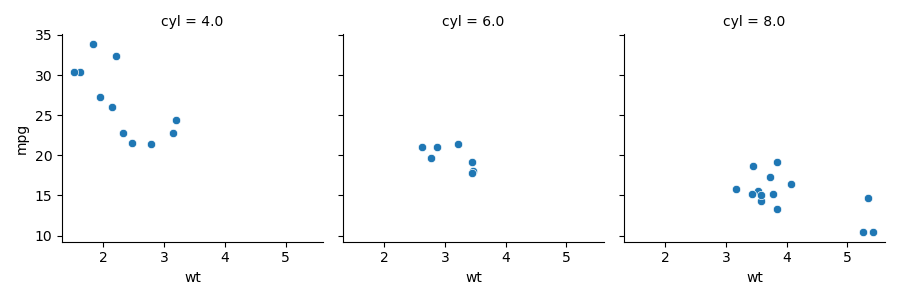

## HW4 - Snakemake



Questions:

1. _How to remove all files created by `snakemake`:_

        snakemake some_target --delete-all-output

2. _How to remove files created by a single `snakemake` rule:_

        snakemake some_target --delete-temp-output

3. _Snakemake Citation_

[Köster, Johannes and Rahmann, Sven. “Snakemake - A scalable bioinformatics workflow engine”. Bioinformatics 2012.](https://bioinformatics.oxfordjournals.org/content/28/19/2520)

### `Snakemake` stderr when my R script is `touch`'d

```
(snakemake) jabermud@WhitesonMacs-Mac-mini ee283_hw4 % touch sqlite3_script.R                          
(snakemake) jabermud@WhitesonMacs-Mac-mini ee283_hw4 % snakemake -j1 -R `snakemake --list-code-changes`
Building DAG of jobs...
Building DAG of jobs...
Using shell: /bin/bash
Provided cores: 1 (use --cores to define parallelism)
Rules claiming more threads will be scaled down.
Job counts:
	count	jobs
	1	all
	1	snakemake_plot
	1	snakemake_sqlite3
	3
Select jobs to execute...

[Tue Feb  2 17:15:17 2021]
rule snakemake_sqlite3:
    output: mtcars.sqlite3
    jobid: 1

[Tue Feb  2 17:15:18 2021]
Finished job 1.
1 of 3 steps (33%) done
Select jobs to execute...

[Tue Feb  2 17:15:18 2021]
rule snakemake_plot:
    input: mtcars.sqlite3
    output: mtcars.png
    jobid: 2

[Tue Feb  2 17:15:19 2021]
Finished job 2.
2 of 3 steps (67%) done
Select jobs to execute...

[Tue Feb  2 17:15:19 2021]
localrule all:
    input: mtcars.sqlite3, mtcars.png
    jobid: 0

[Tue Feb  2 17:15:19 2021]
Finished job 0.
3 of 3 steps (100%) done
Complete log: /Users/jabermud/Documents/ee283_hw4/.snakemake/log/2021-02-02T171517.533581.snakemake.log

```

### `Snakemake` stderr when my python script is `touch`'d

```
(snakemake) jabermud@WhitesonMacs-Mac-mini ee283_hw4 % touch plots_script.py 
(snakemake) jabermud@WhitesonMacs-Mac-mini ee283_hw4 % snakemake -j1 -R `snakemake --list-code-changes`
Building DAG of jobs...
Building DAG of jobs...
Using shell: /bin/bash
Provided cores: 1 (use --cores to define parallelism)
Rules claiming more threads will be scaled down.
Job counts:
	count	jobs
	1	all
	1	snakemake_plot
	2
Select jobs to execute...

[Tue Feb  2 17:19:19 2021]
rule snakemake_plot:
    input: mtcars.sqlite3
    output: mtcars.png
    jobid: 2

[Tue Feb  2 17:19:20 2021]
Finished job 2.
1 of 2 steps (50%) done
Select jobs to execute...

[Tue Feb  2 17:19:20 2021]
localrule all:
    input: mtcars.sqlite3, mtcars.png
    jobid: 0

[Tue Feb  2 17:19:20 2021]
Finished job 0.
2 of 2 steps (100%) done
Complete log: /Users/jabermud/Documents/ee283_hw4/.snakemake/log/2021-02-02T171919.159162.snakemake.log

```

### `Snakemake` stderr when my .sqlite3 file is `touch`'d. 

**It re-runs the same scripts as `touch`ing the .py script.**

```
(snakemake) jabermud@WhitesonMacs-Mac-mini ee283_hw4 % touch mtcars.sqlite3 
(snakemake) jabermud@WhitesonMacs-Mac-mini ee283_hw4 % snakemake -j1 -R `snakemake --list-code-changes`
Building DAG of jobs...
Building DAG of jobs...
Using shell: /bin/bash
Provided cores: 1 (use --cores to define parallelism)
Rules claiming more threads will be scaled down.
Job counts:
	count	jobs
	1	all
	1	snakemake_plot
	2
Select jobs to execute...

[Tue Feb  2 17:22:07 2021]
rule snakemake_plot:
    input: mtcars.sqlite3
    output: mtcars.png
    jobid: 2

[Tue Feb  2 17:22:08 2021]
Finished job 2.
1 of 2 steps (50%) done
Select jobs to execute...

[Tue Feb  2 17:22:08 2021]
localrule all:
    input: mtcars.sqlite3, mtcars.png
    jobid: 0

[Tue Feb  2 17:22:08 2021]
Finished job 0.
2 of 2 steps (100%) done
Complete log: /Users/jabermud/Documents/ee283_hw4/.snakemake/log/2021-02-02T172207.025520.snakemake.log

```